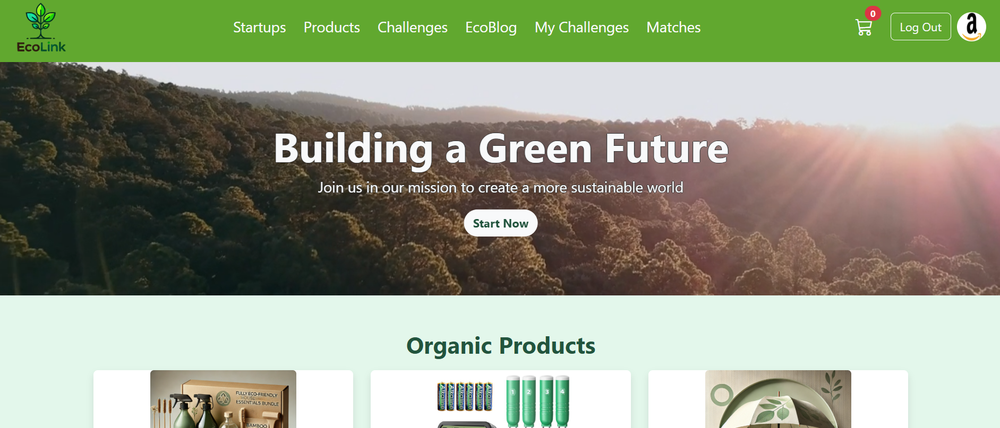
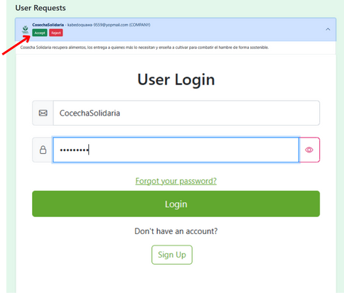
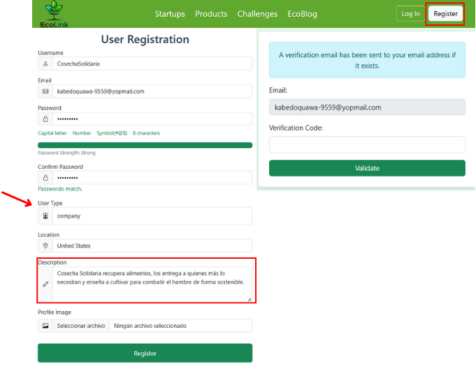
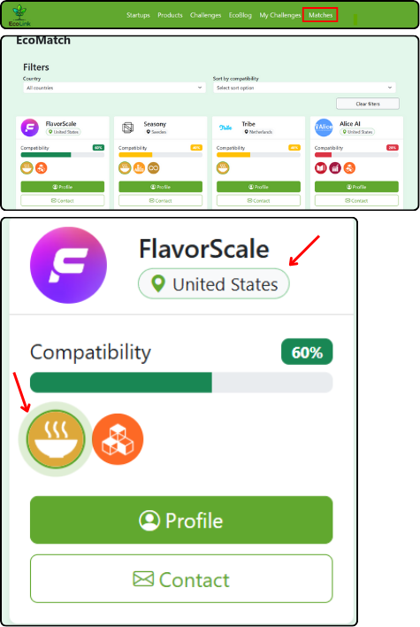
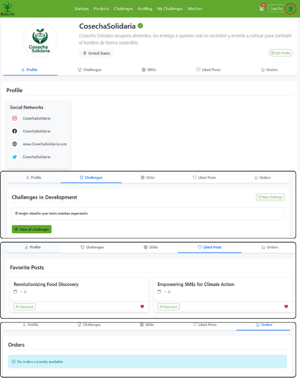
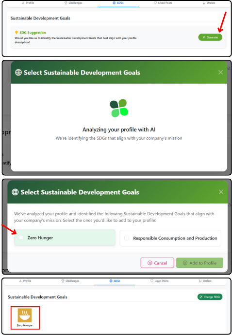

# 🌱 EcoLink - Plataforma de Sostenibilidad y Emprendimiento

EcoLink es una plataforma integral diseñada para conectar startups sostenibles, empresas, consumidores e inversores, con el objetivo de fomentar la innovación y el desarrollo sostenible alineados con los Objetivos de Desarrollo Sostenible (ODS) de la ONU.

## 📋 Características Principales

### 🚀 Espacio para Startups
- **Perfiles de Startup**: Presentación completa de startups con descripción, ODS asociados, información de contacto y localización.
- **Catálogo de Productos**: Muestra de productos sostenibles categorizados por tipo y vinculados a startups específicas.
- **Blog de Innovación**: Publicaciones sobre avances, noticias y logros de las startups en el ámbito de sostenibilidad.

### 🏢 Portal para Empresas
- **Desafíos de Sostenibilidad**: Las empresas pueden publicar retos relacionados con los ODS para encontrar soluciones innovadoras.
- **Gestión de Propuestas**: Sistema para recibir, evaluar y gestionar propuestas de startups a sus desafíos.
- **Inversión en Sostenibilidad**: Herramientas para apoyar financieramente a las startups alineadas con sus objetivos ESG.

### 🛒 Marketplace de Productos Sostenibles
- **Catálogo Diversificado**: Amplia gama de productos categorizados por tipo y ODS relacionados.
- **Proceso de Compra**: Sistema completo de carrito de compras con procesamiento de pagos vía PayPal.
- **Valoraciones y Reseñas**: Los usuarios pueden evaluar productos y startups, mejorando la toma de decisiones.

### 👥 Comunidad e Interacción
- **Sistema de Likes**: Mecanismo para mostrar apoyo a publicaciones y productos.
- **Comentarios**: Funcionalidad para debatir, preguntar y proporcionar feedback.
- **Compatibilidad ODS**: Herramienta para evaluar la afinidad entre startups, empresas y ODS específicos.

### 🔐 Seguridad y Acceso
- **Autenticación Segura**: Sistema de login y registro con gestión de roles (admin, startup, empresa, cliente).
- **Verificación por Email**: Proceso de confirmación para garantizar la legitimidad de los usuarios.
- **Gestión de Perfiles**: Actualización de información personal, preferencias y vinculaciones ODS.

### 🧠 Inteligencia Artificial
- **Integración con DeepSeek**: Análisis y recomendaciones basadas en IA para mejorar la compatibilidad entre stakeholders.
- **Sugerencias Personalizadas**: Recomendación de productos, startups y desafíos basados en preferencias y comportamiento.

## 🛠️ Tecnologías Utilizadas

- **Backend**: Spring Boot 3.4.1 (Java 17)
- **Base de Datos**: H2 Database (desarrollo), MySQL (producción)
- **Seguridad**: Spring Security con JWT
- **Almacenamiento**: Sistema de archivos local para imágenes y recursos
- **Procesamiento de Pagos**: Integración con PayPal API
- **Email**: Servicio de notificaciones vía SMTP
- **Cache**: Redis para gestión eficiente de sesiones y datos frecuentes
- **AI**: Integración con DeepSeek para análisis inteligente

## 📊 Alineación con Objetivos de Desarrollo Sostenible

EcoLink está diseñado para apoyar directamente los 17 Objetivos de Desarrollo Sostenible de la ONU, facilitando que startups, empresas y consumidores encuentren sinergias en áreas como:

- Erradicación de la pobreza y hambre
- Salud y bienestar
- Educación de calidad
- Igualdad de género
- Agua limpia y saneamiento
- Energía asequible y sostenible
- Trabajo decente y crecimiento económico
- Industria, innovación e infraestructura
- Reducción de desigualdades
- Ciudades y comunidades sostenibles
- Producción y consumo responsables
- Acción climática
- Vida submarina y ecosistemas terrestres
- Paz, justicia e instituciones sólidas
- Alianzas para lograr objetivos

## 🚀 Cómo Empezar

### Requisitos Previos
- Java 17
- Maven
- Redis Server
- (Opcional) MySQL para entorno de producción

### Instalación

1. Clone los repositorios:
   ```bash
   git clone https://github.com/dagil23/ecolink-backend-daniel.git
   git clone https://github.com/dagil23/ecolink-frontend-daniel.git

   ```

2. Configure las variables de entorno en un archivo `.env` en la raíz del proyecto:
   ```
   MAIL=your-email@gmail.com
   MAIL_PASSWORD=your-email-password
   SECRET_TOKEN=your-jwt-secret-key
   PAYPAL_CLIENT_ID=your-paypal-client-id
   PAYPAL_CLIENT_SECRET=your-paypal-client-secret
   ```

3. Ejecute la aplicación:
   ```bash
   ./mvnw spring-boot:run
   ```

4. La aplicación estará disponible en `http://localhost:8080`

## 📝 Endpoints de la API

La aplicación expone diversos endpoints para gestionar todas las funcionalidades:

- **Autenticación**: `/api/auth`
- **Startups**: `/api/startups`
- **Productos**: `/api/products`
- **Desafíos**: `/api/challenges`
- **Propuestas**: `/api/proposals`
- **Pedidos**: `/api/orders`
- **Posts**: `/api/posts`
- **Objetivos de Desarrollo Sostenible**: `/api/ods`
- **Perfiles**: `/api/profile`
- **Verificación**: `/api/verify`

## 🔄 Funcionamiento Interno

EcoLink implementa una arquitectura de capas:

1. **Controladores**: Gestionan las peticiones HTTP y las respuestas API
2. **Servicios**: Contienen la lógica de negocio principal
3. **Repositorios**: Gestionan el acceso a los datos
4. **Entidades**: Modelos de datos que representan las tablas de la base de datos
5. **DTOs**: Objetos de transferencia de datos para la comunicación API
6. **Security**: Configuración de autenticación y autorización
7. **Exception Handling**: Gestión centralizada de errores

## 📷 Vista previa

La plataforma incluye múltiples vistas enfocadas a cada tipo de usuario, con paneles específicos para la gestión de:
- Startups y sus productos
- Empresas y sus desafíos de sostenibilidad
- Marketplace para usuarios finales
- Panel de administración para supervisión global

### Capturas de pantalla de la pagina web

### Home 


### Login


### Registro


### Sección de Compatibilidad entre usuarios


### Perfil del Usuario


### Sugerencia de Ods

---

